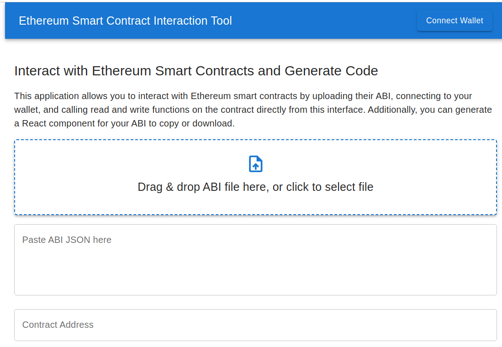
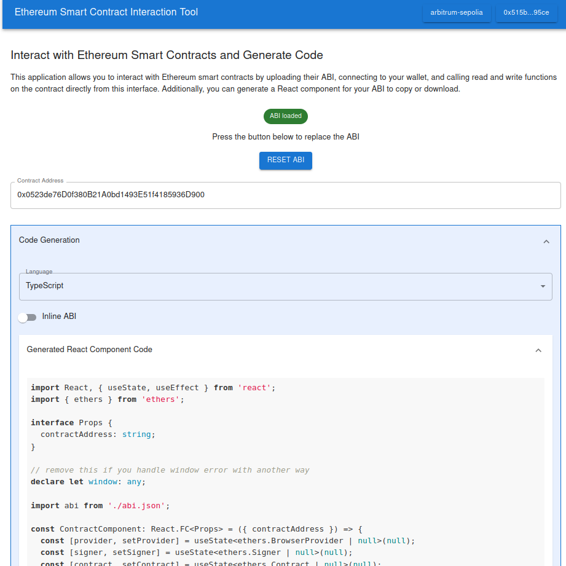

# Ethereum Smart Contract Interaction Tool

This application allows you to interact with Ethereum smart contracts by uploading their ABI, connecting to your wallet, and calling read and write functions on the contract directly from this interface. Additionally, you can generate a React component for your ABI to copy or download.

## Features

- **Smart Contract Interaction**: Upload ABI and interact with Ethereum smart contracts.
- **Code Generation**: Generate React components based on the provided ABI.

## Try It Out

You can use the deployed version of the application [here](https://ethereum-smart-contract-interaction-tool.vercel.app/).

## Preview

### Main Interface


### Call Function


### Code Generation


## Installation

### Prerequisites

- [Node.js](https://nodejs.org/) (v14 or later)
- [Yarn](https://yarnpkg.com/)

### Steps

1. **Clone the repository:**

    ```sh
    git clone https://github.com/SpiralOutDotEu/ethereum-smart-contract-interaction-tool
    cd ethereum-smart-contract-interaction-tool
    ```

2. **Install dependencies:**

    ```sh
    yarn install
    ```

3. **Run the application:**

    ```sh
    yarn start
    ```

4. **Open the application:**

    Open your browser and navigate to [http://localhost:3000](http://localhost:3000).
